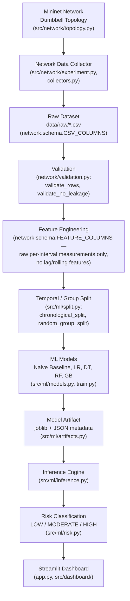

# ARCHITECTURE.md
## System Architecture — Machine Learning-Based Prediction of Packet Loss in Computer Networks

This document describes the system **as actually built and tested** (Phases 1–8). Where a component has not been run against real data, that is stated explicitly rather than implied.

---

## 1. Architecture Diagram



Text form (identical structure, for a non-Mermaid reader):

```
Mininet Network (Dumbbell Topology)
        |
Network Data Collector
        |
Raw Dataset (CSV)
        |
Validation
        |
Feature Engineering (raw measurements, single schema)
        |
Temporal / Group Split
        |
ML Models (Naive, LR, DT, RF, GB)
        |
Model Artifact (joblib + metadata)
        |
Inference Engine
        |
Risk Classification
        |
Streamlit Dashboard
```

## 2. Layer Responsibilities and Interfaces

### 2.1 Mininet Network — Dumbbell Topology
**Module**: `src/network/topology.py`
**Responsibility**: Build a small, reusable, parameterized dumbbell topology — left-side hosts → shaped bottleneck link → right-side hosts — using Mininet's `Topo`/`TCLink` API. Only the `s1<->s2` link is bandwidth/delay/queue-shaped, so packet loss emerges from genuine queue overflow, not an injected loss parameter.
**Interface out**: a running `Mininet` network object, consumed by `src/network/experiment.py`.
**Status**: code complete, unit-tested import path; **never executed against real hardware** (WSL2/Mininet unavailable on the development machine — see Section 4).

### 2.2 Network Data Collector
**Modules**: `src/network/experiment.py` (orchestration), `src/network/collectors.py` (pure parsers for `iperf3`/`ping`/`tc` output)
**Responsibility**: Drive real traffic (`iperf3`) across the topology while sampling `ping` (RTT/jitter) and `tc -s qdisc` (queue backlog) at a fixed interval; merge into per-interval rows.
**Interface in**: an `ExperimentConfig` (`src/network/config.py`) and a running Mininet network.
**Interface out**: a leakage-safe CSV, written via `network.targets.add_next_interval_target()` then `network.schema.CSV_COLUMNS`.
**Status**: code complete, parser logic unit-tested against captured tool-output fixtures; live execution untested (Section 4).

### 2.3 Raw Dataset
**Location**: `data/raw/*.csv`, one file per experiment run (Phase 2's `scripts/generate_dataset.py` sweeps many such runs).
**Schema authority**: `network/schema.py::CSV_COLUMNS` — the single source of truth for every column name, unit, role (identifier/config/feature/target), and description in the entire project. No other module independently redefines this list (verified by repository audit, Phase 8).
**Status**: `data/raw/` currently contains only a `.gitkeep` placeholder — **no real dataset exists**.

### 2.4 Validation
**Module**: `src/network/validation.py`
**Responsibility**: `validate_rows()` — schema/range/consistency checks (contiguous intervals, non-decreasing timestamps, `packets_received <= packets_sent`, loss in `[0,100]`). `validate_no_leakage()` — independently re-derives that every target value equals the correct future-interval measurement within the same experiment group, and never crosses an experiment boundary.
**Interface**: operates on the same `CSV_COLUMNS` list; called automatically by `ml.dataset.load_dataset()` before any training data is used.

### 2.5 Feature Engineering
**Authority**: `network/schema.py::FEATURE_COLUMNS` (15 columns: 5 configured-condition + 10 measured-current-interval; `traffic_type` is the only categorical feature). **No lag/rolling/windowed feature engineering exists in this codebase** — confirmed by repository grep audit (Phase 8) — the model trains directly on raw per-interval measurements. This is a deliberate scope decision documented since Phase 4, not an oversight.
**Preprocessing**: `src/ml/preprocessing.py::build_preprocessor()` — median imputation for all features, `StandardScaler` for numeric features only when the target model needs it (Linear Regression), one-hot encoding for `traffic_type`. Built as an `sklearn.ColumnTransformer`, always fit on train only.

### 2.6 Temporal / Group Split
**Module**: `src/ml/split.py`
**Responsibility**: `chronological_split()` (train on earlier experiments, test on later ones by earliest timestamp) and `random_group_split()` (fixed-seed random hold-out of whole experiment groups). Both operate on **entire `experiment_id` groups**, never individual rows, and both call `assert_no_group_overlap()` internally as a structural guarantee.

### 2.7 ML Models
**Module**: `src/ml/models.py`, `src/ml/train.py`, `src/ml/baselines.py`
**Candidates**: Naive persistence baseline (`predicted = current packet_loss_pct`), Linear Regression, Decision Tree Regressor, Random Forest Regressor, Gradient Boosting Regressor — all `sklearn` pipelines with a fixed `RANDOM_SEED = 42`.
**Interface**: `train_and_evaluate(train_df, test_df)` fits every model on train, predicts on test, returns metrics + fitted pipelines + predictions in one structure.

### 2.8 Model Artifact
**Module**: `src/ml/artifacts.py`
**Format**: the fitted `sklearn.Pipeline` (preprocessing + estimator together) serialized via `joblib`, plus a JSON `ModelMetadata` sidecar (`model_name`, `feature_columns`, `target_column`, `training_config`, `metrics`, `is_test_fixture`, `training_timestamp`).
**Status**: `models/` currently contains only `.gitkeep` — **no production artifact exists**.

### 2.9 Inference Engine
**Module**: `src/ml/inference.py`
**Responsibility**: `validate_feature_input()` (strict feature contract enforcement — missing/extra/NaN/inf/negative/out-of-range rejected, with a specific error for anything that looks like leaked target/future information) → `build_feature_frame()` (canonical-order single-row DataFrame) → `InferenceEngine.predict()` (runs the loaded pipeline) → `PredictionResult`. `load_production_model()` and `load_test_fixture_model()` enforce, structurally, that a test-fixture artifact can never be used as production and vice versa.

### 2.10 Risk Classification
**Module**: `src/ml/risk.py`
**Responsibility**: `classify_risk()` maps a predicted packet-loss percentage to LOW/MODERATE/HIGH using fixed, documented, a-priori thresholds (`low_max=0.1`, `moderate_max=1.0`) — never fit or tuned against any dataset. Always derived from the **predicted** value, never an actual/future one.

### 2.11 Streamlit Dashboard
**Modules**: `app.py` (presentation only), `src/dashboard/` (`feature_inputs.py`, `model_status.py`, `history.py`, `reports.py` — all pure Python, independently unit-testable, none reimplement inference/preprocessing/risk logic)
**Responsibility**: renders `PredictionResult`s, manages PRODUCTION/DEMONSTRATION mode selection (never silently falls back), an in-session prediction history (bounded, never persisted to disk), and reads (never recomputes) any real Phase 4 report artifacts under `reports/modeling/`.

## 3. Cross-Cutting Design Property: One Feature Contract

Every layer above — raw CSV, validation, training, the saved model artifact's own metadata, the inference engine's input validator, and the dashboard's input widgets — reads `FEATURE_COLUMNS`/`TARGET_COLUMN` from the same single module (`network/schema.py`). This was verified end-to-end in one test this project (`tests/test_end_to_end_integration.py`), not just asserted by design.

## 4. What Has and Has Not Been Executed

| Layer | Code status | Executed against real data? |
|---|---|---|
| Mininet topology / data collector | Complete, parser-tested | **No** — WSL2/Mininet unavailable on the dev machine |
| Raw dataset / validation / feature engineering | Complete, fixture-tested | **No real dataset exists** |
| ML models / evaluation | Complete, fixture-tested | **No** — nothing to train on |
| Model artifact / inference engine | Complete, fixture-tested | **No production artifact exists** |
| Risk classification | Complete, fixture-tested | Runs on fixture predictions only |
| Streamlit dashboard | Complete, starts cleanly, fixture-tested | Runs in DEMONSTRATION mode only |

See `docs/PHASE_5_REAL_DATA_VALIDATION.md` for the specific environment blocker and `docs/RESULTS.md` for the full engineering-vs-empirical breakdown.
